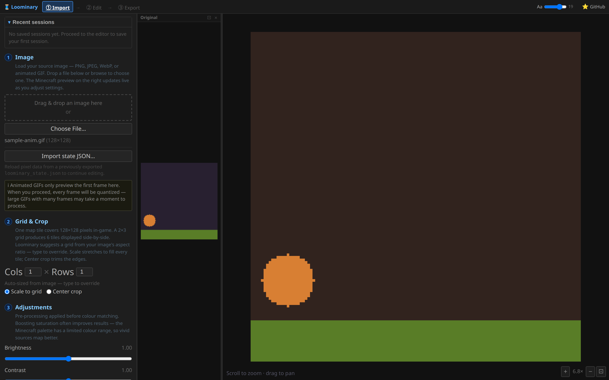
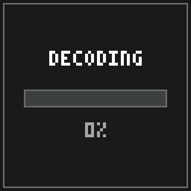
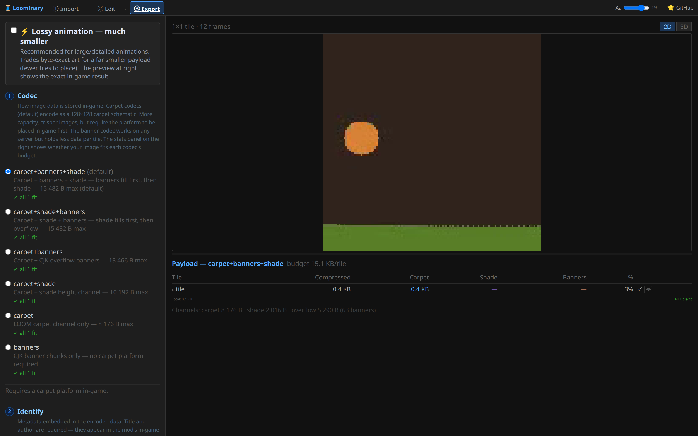

# Animated map art

Drop an animated GIF into the web editor and the pipeline stays the same (import, edit, export, place), except the framed map now *plays* the animation. Frames advance on a wall-clock timer, synchronized for every viewer and across every tile of a mural.

## Importing animation

GIF frames are fully composited on import (disposal methods handled), with each frame's own delay preserved (clamped to ≥10 ms; frames without timing default to 100 ms). The import preview shows frame 1; **Proceed** then quantizes every frame in a parallel worker pool with a per-frame progress bar. Decoding uses the browser's `ImageDecoder` (Chrome/Edge 94+; other browsers import the first frame only).

## Editing frames

The [editor's frame strip](Editor-Tools#animation-frames) gives you playback, scrubbing, per-frame delays (**,** / **.** nudge ±10 ms; an "all" button syncs every frame), clone/blank/delete/reorder, and **stride/skip thinning**, which keeps or drops every *n*-th frame with delays merged so overall timing is preserved. Every tool and overlay works per frame; requantize, filters, and palette merges optionally apply across **all frames**.

## How animations fit in the budget

A raw frame is 16,384 bytes; a tile's whole [budget](Codecs-and-Capacity) is ~15 KB *compressed*. Animation works because consecutive frames share most of their content, and Loominary exploits that with a real video codec:

- **Lossless AV1** (automatic): frames are encoded as an AV1 stream over the palette indices. The result is pixel-exact, and the exporter uses it whenever it beats raw-frames-plus-zstd for the tile.
- **Lossy AV1** (the "⚡ Lossy animation" toggle, quality 1–100, default 60): real lossy video, re-quantized to the palette on decode. It makes a large difference for dithered or noisy animations that compress poorly losslessly. The export preview runs the same decoder binary the mod ships (compiled to WebAssembly in the browser, to JVM bytecode in the mod), so what you preview is byte-for-byte what players will see. The panel reports the measured pixel-difference percentage at your chosen quality.
- **Multi-tile animations are seamless**: a lossy animated mural encodes as one AV1 stream across the whole composition, split byte-wise over the tiles, so there are no per-tile encode boundaries and no seams. In exchange, decoding is all-or-nothing: every tile must be scanned once before any of them plays, and waiting tiles show a WAITING screen counting scanned siblings.

## In-game playback

- **Decode**: heavy animations take a few seconds off-thread; the map shows a live **DECODING** progress bar, then starts playing.

  

- **Timing**: frames advance on wall-clock time using the GIF's own per-frame delays (loop counts honored).
- **Sync**: maps are grouped by author + title + grid, and an entire mural advances as one unit. The wall never shows mixed frames, and two players standing together see the same frame.
- **Culling**: tiles farther than 32 blocks pause; they rejoin the sync group, on the correct frame, as you approach.

## Making animations fit

1. Reducing distinct colors helps most; restrict the palette at import.
2. Keep import dithering off (the default): dither noise varies frame to frame, and temporal noise is what video codecs handle worst. Let lossy mode render gradients instead.
3. Thin frames with stride/skip before dropping quality; 15 fps still reads as smooth on a map.
4. If it still doesn't fit, enable the lossy toggle and walk quality down from 60 until it fits.

