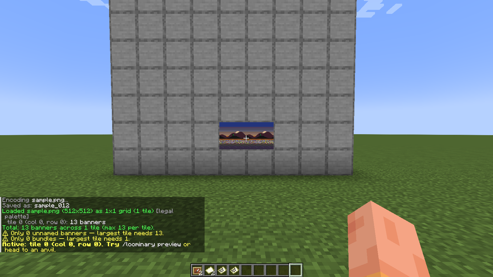
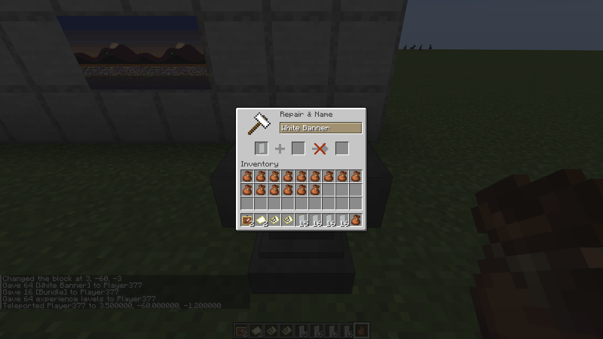

# Anvil & banners

Whenever a tile's payload spills past the carpet channel — or you're in [banner-only mode](Banner-Mode-Legacy) — data travels as **banner names**. This page covers the whole banner half of the pipeline: the anvil automation that writes the names, and the click automation that registers them onto your map.

## What you need

| Item | How much | Why |
|---|---|---|
| Unnamed banners (any color) | one per chunk (`/loominary status` shows the count; ≤63 per tile) | each carries 84 bytes in its name |
| Empty bundles | ~1 per 16 banners | the handler packs renamed banners into them automatically |
| XP | **1 level per banner** | anvil renames aren't free |



## The anvil auto-renamer

Open any anvil with the above in your inventory and the mod takes over — no clicking:



1. It pulls one unnamed banner into the anvil, types the next chunk string (a 2-character hex index + 48 CJK characters), and takes the result — about one banner every few ticks.
2. Renamed banners go straight into your bundles, keeping inventory tidy for long batches.
3. Progress persists: `PayloadState` records the chunk index after every rename, so you can close the anvil, log off, or die, and resume where you left off (`/loominary seek <n>` manually repositions if needed).

**It pauses itself, politely.** Out of XP → `Paused — out of XP.` and it resumes the moment you restock. Same for banners and bundles. Nothing is lost by walking away.

**The stuck case.** If the server *permanently* rejects a specific name (rare — usually an aggressive chat filter), the handler halts rather than burn XP retrying: `Stuck — re-export from the web editor (fresh salt), then /loominary load`. Every web export carries a fresh random salt, so all chunk names change while the image stays identical. Loading the new state clears the halt; discard the already-renamed banners from the old attempt.

**Reusing banners.** Named banners from an old batch can be recycled: `/loominary whitelist add` scans your inventory and bundles and marks every named banner as fair game for re-renaming (the handler otherwise refuses to touch named items — they might be yours). `/loominary whitelist clear` resets.

## Placing and registering

Renamed banners can be placed **anywhere inside the 128×128 world area the map covers** — they don't need to be near the item frame, and once registered they can even be broken (the map keeps the marker).

The registration itself is one right-click per banner while holding the target map. That's tedious for 40 banners, so:

```
/loominary click
```

- Scans ±5 blocks around you for placed banners whose names are pending chunks, and right-clicks the closest one every 5 ticks (reach ~4.5 blocks — walk the field and it works through them).
- **Wireframe markers** show state: **yellow** = clicked, waiting for the server; **green** = confirmed registered.
- The action bar narrates: `Clicking banners... (N remaining)` → `Waiting for server... (N pending)` → `Map decoded — auto-click complete.` (It also nags `Hold your map to continue.` if you switch items.)
- `/loominary click stop` or the global `/loominary stop` halts it.

Each click makes the server record the banner's name as a map decoration — that's the *only* server-side interaction in the whole banner pipeline. The mod suppresses the marker pins client-side afterward so they never clutter the art.

## The banner-layout schematic

Exporting a banner-codec tile in-game (`/loominary export`) also writes a Litematica schematic laying the named banners out in a 16-wide grid — **a labeled reference, not a required placement**. Use it to see every banner's name in one place; in the world you can arrange them however you like within the map area.

## Capacity math

One name: 50 chars = 2-char hex index + 48 CJK payload chars × 14 bits = **84 bytes**. A map accepts up to 63 banner markers → 63 × 84 − 2 (length header) = **5,290 bytes** in pure banner mode, or 5,290 on top of the carpet channel in the default codec. Full accounting: [Codecs & Capacity](Codecs-and-Capacity).
