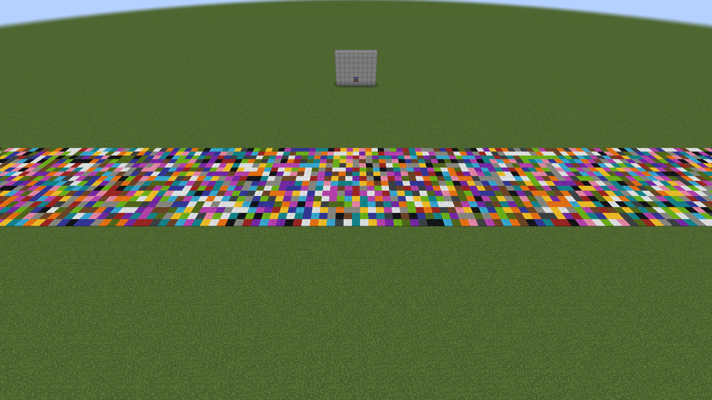
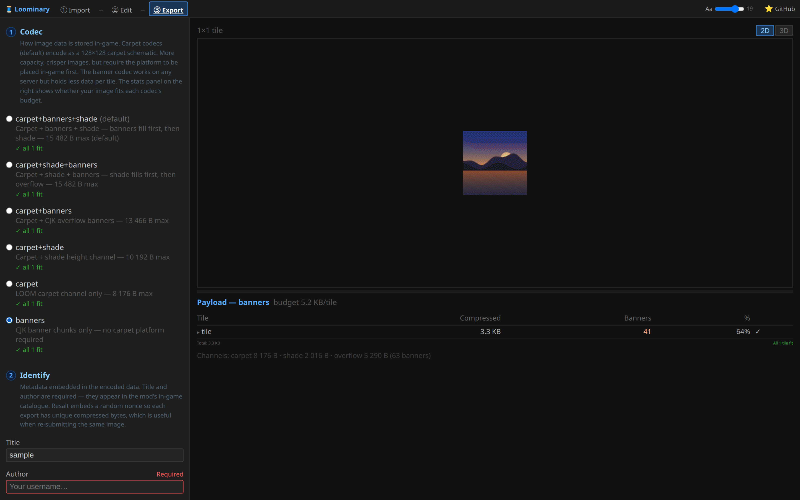

# Codecs & capacity

Every 128×128 map tile carries its art as compressed bytes smuggled through vanilla data channels. The **codec** chooses which channels — and therefore the tile's byte budget. This page is the full accounting.

## The three channels

**Carpet — 8,176 bytes.** Minecraft has exactly 16 carpet colors; 16 values = 4 bits. Two carpets encode one byte, and a map has 16,384 pixels, so a flat carpet platform holds 8,192 bytes — minus a 16-byte `LOOM` header the decoder finds at the map's top-left corner. When you scan a map over the platform, the *server itself* delivers the data to every viewer as ordinary map colors.

**Shade — +2,016 bytes.** Maps render a carpet brighter or darker depending on the terrain height to its north. By building the platform as a *staircase* (heights 0–2 in balanced 4-row patterns that always return to baseline), each 4-row group of a column encodes 4 extra bits. Tiles using this channel export a staircase schematic instead of a flat one.

**Banners — +5,290 bytes.** An anvil rename holds 50 characters. CJK Unified Ideographs survive server text normalization untouched and pack **14 bits per character**, so one banner name = a 2-character index + 48 payload characters = **84 bytes** (2.33× base64). Up to 63 banners per map (a conservative cap some servers enforce); registered onto the map as markers by right-clicking with it. See [Anvil & Banners](Anvil-and-Banners).

## The codecs

| Codec | Channels (fill order) | Budget | Needs platform? |
|---|---|---|---|
| `carpet+banners+shade` **(default)** | carpet → banners → shade | **15,482 B** | yes |
| `carpet+shade+banners` (web only) | carpet → shade → banners | 15,482 B | yes |
| `carpet+banners` | carpet → banners | 13,466 B | yes |
| `carpet+shade` | carpet → shade | 10,192 B | yes (staircase) |
| `carpet` | carpet only | 8,176 B | yes |
| `banners` | banners only | 5,290 B | **no** ([legacy mode](Banner-Mode-Legacy)) |

The default fills banners before shade because a few overflow banners are usually less work than building a staircase; the web-only `carpet+shade+banners` variant flips that preference. In-game: `/loominary codec <mode>` re-encodes the loaded batch.

## What compression buys you

Budgets sound small — a raw frame is 16,384 bytes before compression. But quantized map art is extremely zstd-friendly: typical images compress to **1,500–6,000 bytes**, so most single images fit in the plain `carpet` budget with room to spare. The compression detail overlay in the [editor](Editor-Tools#diagnostic-overlays) (**Z**) shows exactly which regions cost bytes; the [palette tools](Dithering-and-Color-Matching) shrink them.

## Overheads worth knowing

| Item | Cost |
|---|---|
| LOOM header (carpet codecs) | 16 B per tile |
| Manifest (version, grid, title ≤64, author ≤16, CRC32, nonce, animation table) | ~40–100 B, inside the compressed payload |
| [Encryption](Encryption-and-Sharing) | ≈290 B + 76 B per password slot, per tile |
| Mux guest descriptor | 10 B per guest carried by a donor |
| Per-frame delay table (animated, v5+) | 2 B per frame |

## When a tile doesn't fit

In order of preference:

1. **Shrink it** — palette reduction, gentler dithering, fewer distinct colors ([guide](Dithering-and-Color-Matching)).
2. **Mux** — on multi-tile grids, spill the overflow into under-budget sibling tiles ([guide](Multi-Tile-and-Mux)).
3. **Higher-capacity codec** — e.g. `carpet+shade` → the full default.
4. **Animations**: thin frames (stride/skip) or switch to [lossy AV1](Animated-Art).

The export page refuses to pretend: over-budget tiles are flagged per tile, and exporting anyway pops an explicit warning that the art won't decode in-game until it fits.
