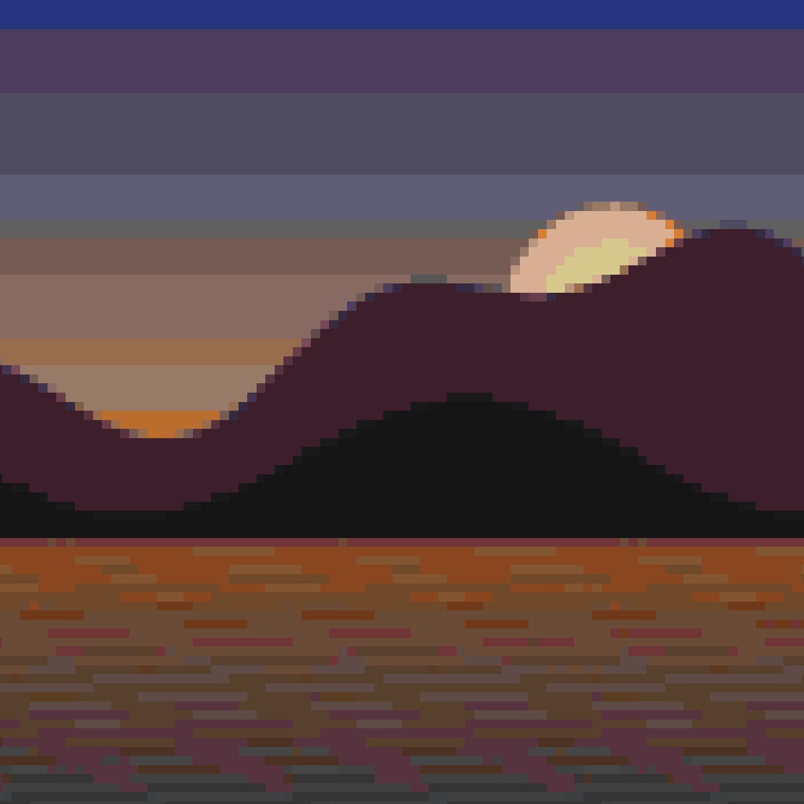
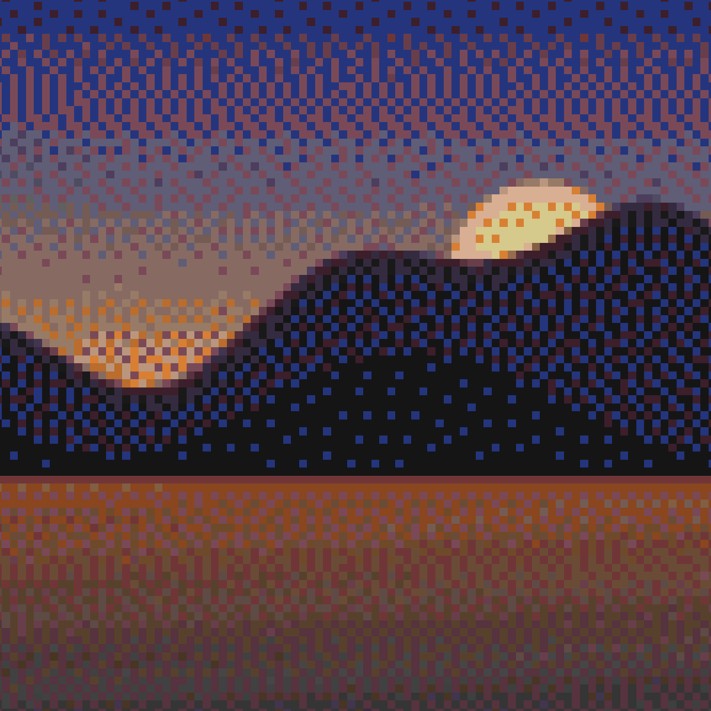
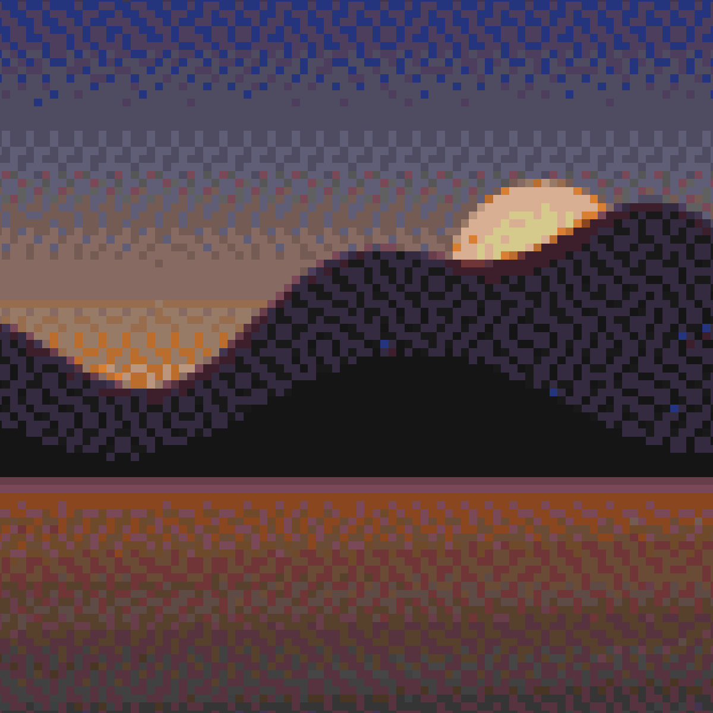
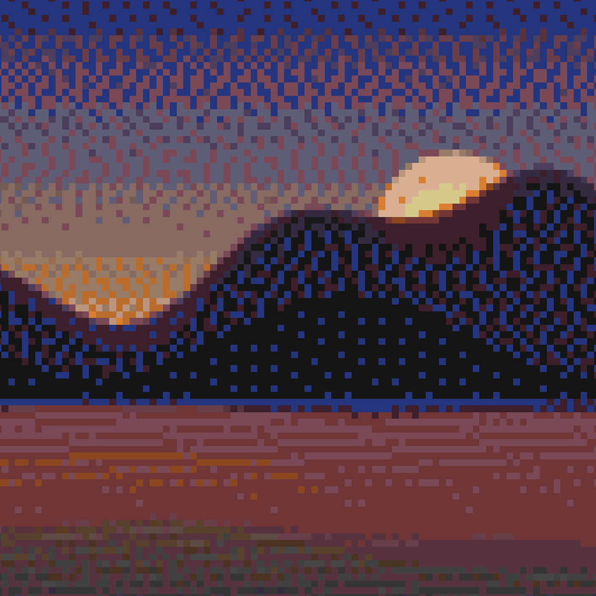
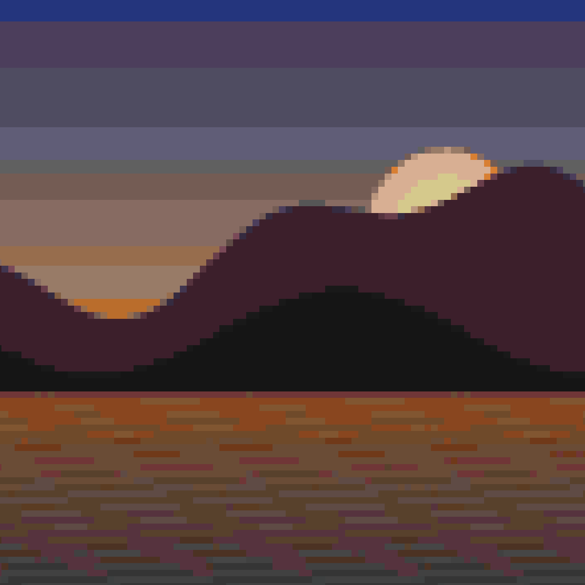
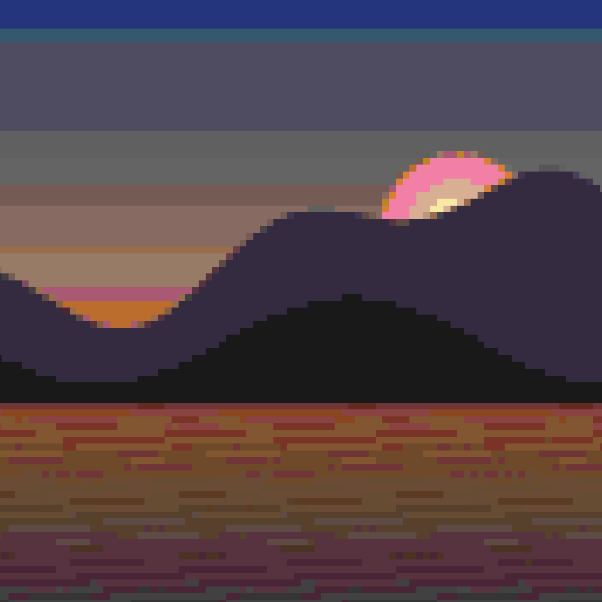
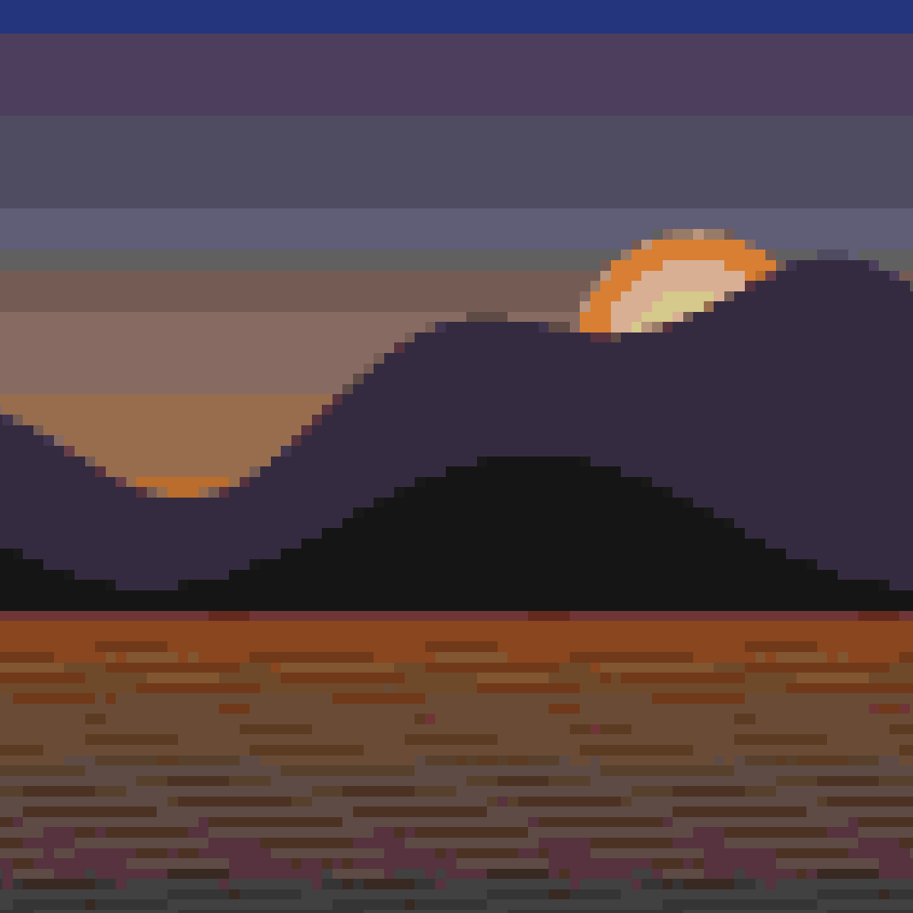

# Dithering & color matching

The single biggest lever on output quality is how your image's true colors get mapped onto Minecraft's limited map palette. This page covers the whole quantization toolbox: the ten dither algorithms, the five match metrics, chroma boost, and palette restriction. Everything here lives in **Step 5 (Quantization)** and **Step 4 (Palette)** of the [import page](Web-Editor-Import), and identically in the editor's Requantize panel.

## Dithering: trading resolution for color

Dithering scatters two palette colors in a pattern your eye blends into an in-between shade — it's how a ~183-color palette fakes thousands. The cost: texture. Loominary offers ten algorithms; the same sunset with a few of them:

| None | Floyd–Steinberg | Atkinson |
|---|---|---|
|  |  |  |

| JJN | Stucki | Bayer (ordered) |
|---|---|---|
|  |  |  |

### The algorithms

**Error-diffusion family** — each pixel's rounding error is pushed onto its neighbors; differences are in how far and how evenly the error spreads:

| Chip | Algorithm | Character |
|---|---|---|
| `FS` | Floyd–Steinberg | The classic. Tight 4-neighbor spread; the first one to try |
| `Atk` | Atkinson | Only diffuses 6/8 of the error — softer, brighter, preserves highlights; the retro Mac look |
| `Sierra` | Sierra (3-row) | Wide, smooth spread; very even gradients |
| `Sierra2` | Sierra Two-Row | Slightly cheaper/sharper Sierra |
| `SierraL` | Sierra Lite | Minimal 1-row spread; crisp, close to FS |
| `Shiau` | Shiau–Fan | 1-row variant designed to suppress FS's worm artifacts |
| `JJN` | Jarvis–Judice–Ninke | The widest 3-row kernel; the smoothest gradients, softest detail |
| `Stucki` | Stucki | JJN refined; smooth with a bit more edge retention |

Every error-diffusion algorithm gets a **strength slider (0.1–1.0)** — lower values diffuse less error, giving cleaner flats at the cost of banding — and a **serpentine scan** checkbox (alternates scan direction per row, breaking up directional drift; try it if you see diagonal "worms").

**Ordered:** `Bayer` uses a fixed threshold matrix instead of error diffusion — a regular crosshatch pattern that compresses well and reads as deliberate texture. Options: **Bayer scale** (0.02–0.20, pattern contrast) and **matrix size** (2×2 / 4×4 / 8×8 / 16×16 — smaller = coarser pattern).

**`None`** — the **default** — disables dithering: every pixel snaps to its single nearest palette color. It's the right call for logos, flat-color art, and [animations](Animated-Art) (dither noise is what video codecs hate most); switch to an error-diffusion algorithm when gradients start banding.

### Adaptive strength

With FS selected at import, Loominary computes a **per-pixel dither strength map** from local image detail: smooth gradients dither fully, sharp edges and flat fills stay clean. In the editor you can view this mask (**M**) and even paint it manually with the dither brush — see [Editor Tools](Editor-Tools).

## Match metrics: what "closest color" means

When a pixel needs a palette color, the metric defines distance:

| Chip | Metric | When to use |
|---|---|---|
| `OKLab` | Perceptual OKLab distance, equal weight on lightness and color | The right default for almost everything |
| `Chr+` | 4× weight on hue/saturation vs lightness | Saturated, vivid art where color identity matters more than brightness |
| `Lum+` | 4× weight on lightness vs hue | Faces, landscapes, near-greyscale — protects tonal structure |
| `Hue` | Matches only the color-wheel angle (near-grey pixels fall back to OKLab) | Flat cartoon/pixel art with strong hues |
| `RGB` | Euclidean distance in linear sRGB | Occasionally beats OKLab on synthetic gradients |

OKLab vs RGB vs chroma-first on the same image:

| OKLab | RGB | Chr+ |
|---|---|---|
|  |  |  |

**Chroma boost** (0.25–4.0×, default 1.0) multiplies the OKLab chroma components before matching — values above 1 push pixels toward more saturated palette entries. The map palette is muted, so a boost of 1.2–1.5 often livens up washed-out results. (Keyboard in the editor: **N** / **Shift+N**.)

## Palette restriction

Step 4 limits which palette entries quantization may use:

| Choice | Colors | For |
|---|---|---|
| Flat fullblock | 61 | flat single-height full-block builds (shade 1 only) |
| **Staircase fullblock** (default) | 183 | full-block builds with height variation (shades 0–2) |
| All shades | 244 | maximum fidelity — includes shade 3, which no real block placement produces |
| Greyscale | varies | neutral tones only; a **chroma threshold** slider (5–120) sets how strict "grey" is |
| Flat carpet | 16 | art buildable as a flat carpet sheet |
| Staircase carpet | 48 | carpet colors × shades 0–2 |

Fewer colors also means smaller payloads — a restricted palette is a legitimate [budget](Codecs-and-Capacity) tool, not just an aesthetic one.

## The match-quality score

Above the preview, **"Palette coverage: N%"** reports the fraction of pixels whose nearest palette color lands within a perceptual ΔE of 0.05 — green ≥75%, amber ≥50%, red below — plus the average ΔE. It measures *palette suitability only* (dithering and chroma boost don't move it), which makes it perfect for A/B-ing palette choices and adjustments objectively.

## A tuning recipe

1. Start with defaults (Staircase fullblock, OKLab, dithering off).
2. Nudge **saturation** up ~1.1–1.3 in Adjustments; watch the coverage score.
3. Banding in gradients? Turn dithering on (`FS`); still banding, try JJN. Noise in flats? Lower the strength, or try Atkinson.
4. Colors feel muddy? Chroma boost 1.25, or metric `Chr+`.
5. Making an animation? Dither `None`, fewer colors, let [lossy AV1](Animated-Art) handle the gradients.
