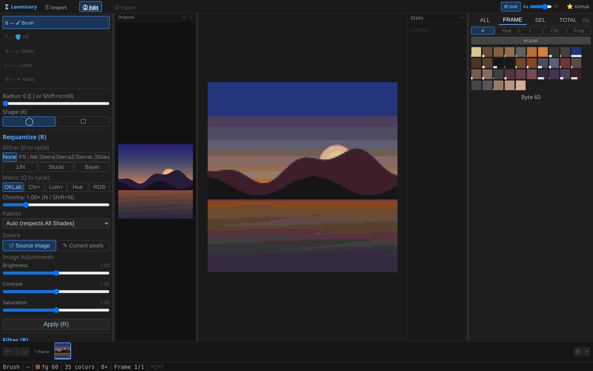
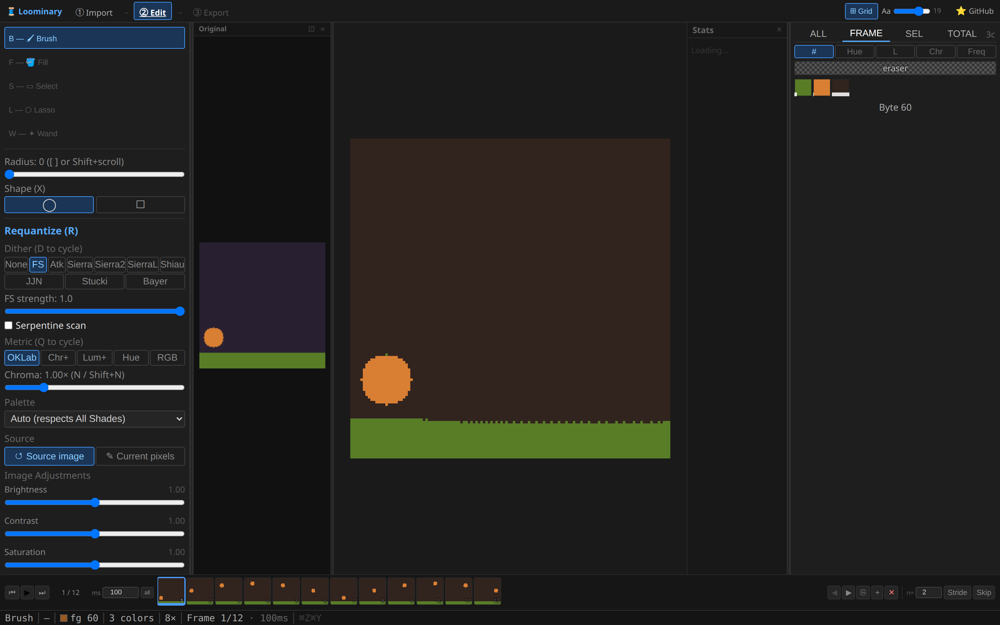

# Editor tools & shortcuts

Complete reference for the [web editor](Web-Editor-Editing)'s pixel-editing surface. Everything works directly in map-color space, so nothing you paint can ever be undisplayable in-game.

## The tools

| Key | Tool | Left click | Right click | Options |
|---|---|---|---|---|
| **B** | 🖌 Brush | paint the active color | eyedrop | radius 0–32 (slider) / 0–64 (`[` `]`), shape ◯/□ (**X**) |
| **F** | 🪣 Fill | tolerance flood fill | eyedrop | OKLab tolerance 0–0.5 (`=`/`-` or Shift+scroll); hover shows a live preview of what would fill |
| **S** | ▭ Select | drag marquee (Shift add, Ctrl subtract) | subtract | plain click clears |
| **L** | ⬡ Lasso | drag freehand add; single clicks drop polygon vertices, double-click closes | subtract / cancel path | Ctrl subtracts |
| **W** | ✦ Wand | flood-select contiguous color (Ctrl subtracts) | subtract | same tolerance slider; hover preview (blue = add, orange = subtract) |

Brush strokes are interpolated (no gaps on fast drags), and the fill/wand tolerance is perceptual (OKLab), so "similar color" behaves like your eye expects.

## Selections

Once a selection exists, painting and fills are constrained to it, and the selection ops appear:

| Action | Keys |
|---|---|
| Deselect / Select all / Invert | **Esc** · **Ctrl+A** · **Ctrl+I** |
| Grow / Shrink by 1 px (×5 with Shift) | **=** · **-** |
| Copy / Cut / Paste | **Ctrl+C** · **Ctrl+X** · **Ctrl+V** (Esc cancels a floating paste, Enter commits) |
| Clear selected pixels to transparent | **Delete** |

## The palette panel

Tabs: **ALL** (every legal color, optionally filtered by the same six [palette choices](Dithering-and-Color-Matching#palette-restriction)) · **FRAME** (colors in the current frame, default) · **SEL** (colors inside the selection) · **TOTAL** (all frames). Sort by byte value, hue, lightness, chroma, or frequency. Each swatch shows a frequency bar; the transparent "eraser" is pinned first.

- **Click** a swatch → active color. **Ctrl+click** → add to the **merge queue** (orange outline).
- **Merge queue → C**: every queued color is repainted as the active color, across the frame or all frames (**V** toggles scope). This is the palette-reduction workhorse — queue the rare junk colors, pick their replacement, press C.
- **Shift+click** a swatch while a selection is active → remove that color from the selection.

## Requantize, filters, reduce

The left panel re-runs the import pipeline on demand:

- **Requantize (R)** — re-match pixels against a palette using the full [dithering & metric toolbox](Dithering-and-Color-Matching) (all 10 algorithms, 5 metrics, chroma boost, palette choice including "Tile colors" and the merge queue as a custom palette). Source can be the **original image** (crisp re-derivation — "Re-link file…" if the browser lost it) or the **current pixels**. Results preview first: **Enter/Y** commits, **Esc** cancels.
- **Filter (P)** — Smooth / Median / Sharpen (strength 0.5–3) / Posterize (2–8 levels), per frame or all frames. **Shift+P** cycles the type.
- **Reduce (K)** — remove one color per press using the Rarest / Closest / Weighted strategy (**Shift+K** cycles). Watch the distinct-color count in the status bar.

## Diagnostic overlays

| Key | Overlay | Reading it |
|---|---|---|
| **H** | Rarity heatmap | red = rarest colors (cheap to merge away), blue = most common |
| **Z** | Compression detail map | bright = expensive to compress — where your [byte budget](Codecs-and-Capacity) is going |
| **M** | Dither-strength mask | where adaptive dithering will apply; paintable with the dither brush |

## Animation frames

The bottom strip appears for animated art: play/pause (**Space**), prev/next (**< >** or **Ctrl+[ ]**), scrubbing, per-frame **delay** (10–10,000 ms, "all" applies everywhere, **, .** nudge ±10 ms), reorder (◀ ▶), clone (⎘), blank (+), delete (✕ or **Delete**), and **stride/skip** thinning (keep or drop every nth frame, delays merged so timing is preserved).

## Everything else

- **Undo/redo**: **Ctrl+Z** / **Ctrl+Shift+Z**, 20 levels.
- **Zoom/pan**: scroll wheel / drag; the status bar shows the zoom, cursor tile + local coordinates, hovered color byte, distinct-color count, and frame position.
- **⊞ Grid** (step bar): edit a whole multi-tile composition as one canvas.
- Sessions auto-save continuously (IndexedDB, source image included).
