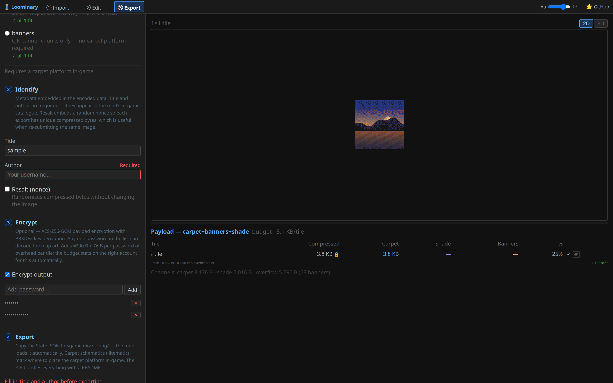

# Encryption & sharing

## Sharing your art

Loominary art lives entirely in vanilla data (map NBT, world blocks), so sharing comes in three flavors:

- **In-world**: anyone running Loominary within 32 blocks of your framed, locked map sees the art. Nothing to distribute.
- **As files**: the export ZIP is the whole project. Someone with your `loominary_state.json` (→ their `config/`) and schematics can rebuild the art anywhere — and the state JSON **re-imports into the web editor**, so they can remix it. Send the ZIP, done.
- **Out of the world**: capture any existing framed art with `/loominary import steal` — see [Archiving map art](Stealing-Map-Art).

Every payload embeds a **title** (≤64 chars) and **author** (≤16), plus a CRC32 integrity check and a random nonce, so provenance travels with the art.

## Password protection

On the [export page](Web-Editor-Export), tick **Encrypt output** and add one or more passwords:



### How it works

- The payload is encrypted with **AES-256-GCM** under a random data key. Each password gets its own **key slot**: the data key wrapped under a PBKDF2-derived key (SHA-256, 100,000 iterations, per-slot salt). **Any one password decodes** — so you can hand different groups different passwords, and cut a group off by re-exporting without their slot.
- Overhead is modest and the export stats account for it: ≈290 bytes + 76 bytes per password slot, per tile.
- There is no plaintext fallback. The carpet platform and banner names *are* the ciphertext; to a player without the mod, an encrypted map is indistinguishable from any other Loominary map.

### Viewing encrypted art

Viewers need the mod **and** a matching password:

```
/loominary password add <password>
```

Passwords persist across sessions and are tried automatically against every encrypted map encountered (`list` / `remove <pw>` / `clear` manage the ring). Without a match, the map shows the lock screen:


Adding the right password makes the art appear on the next scan — nothing needs rebuilding.

For batches you're placing yourself in-game, `/loominary password encrypt <pw>` encrypts the loaded batch's payloads before placement (`encrypt off` stops).

## Caveats

- **Passwords are not recoverable.** Keep your web-editor session (it auto-saves, source included) so you can always re-export with new slots.
- Encryption covers the image and its metadata. The *existence* of Loominary-encoded data is visible to any mod user — that's precisely what the lock screen indicates.
- Changing the password set changes the payload bytes: expect to re-place banners (and re-scan) after a re-export, as with any payload change.
