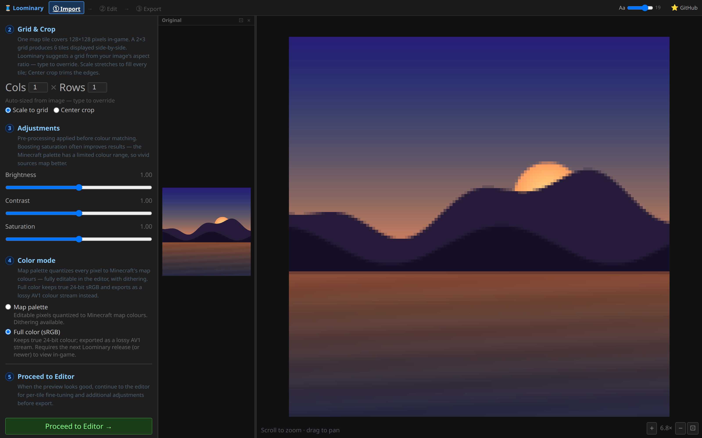
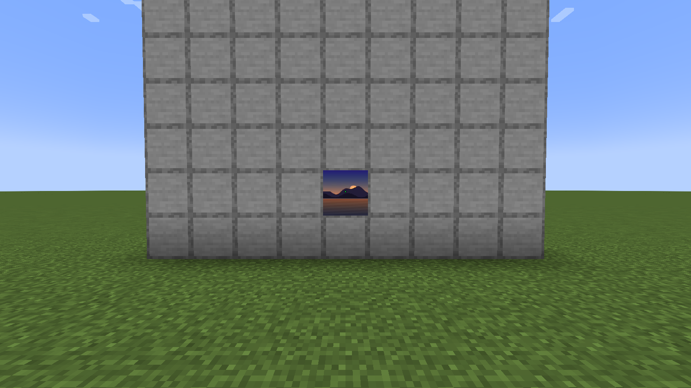
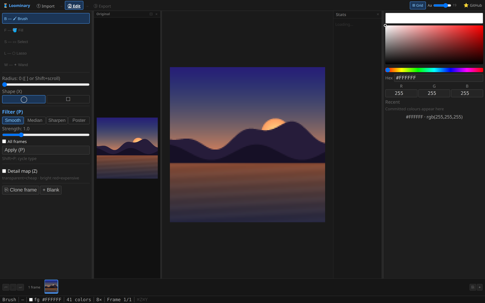
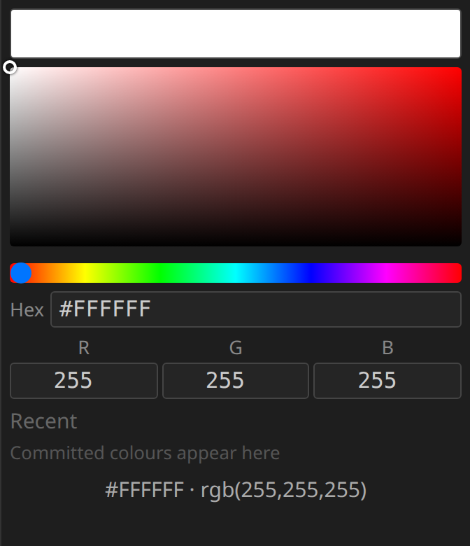

# Full color (sRGB)

Full color mode keeps your art in true 24-bit sRGB instead of quantizing it to Minecraft's map palette. You choose it once at import, and the whole pipeline works in real color from then on: the editor gets a proper color picker, the export page measures fidelity in ΔE and PSNR, and in-game the mod paints the decoded RGB straight into the map texture. Displaying it requires mod **v2.1.0 or newer**; the physical build, byte budgets, and file formats around the payload are unchanged.

## Choosing the mode

The [import page](Web-Editor-Import) has a **Color mode** step with two options:

- **Map palette** (the default). Everything works exactly as the rest of this wiki describes.
- **Full color (sRGB)**. The art keeps its original colors. The palette restriction and quantization/dithering steps are hidden, because nothing is quantized to the map palette.

The choice applies to the whole composition, animation frames included.

## Palette mode or full color?

The same art both ways, on real in-game maps:

| Map palette | Full color (sRGB) |
|---|---|
|  |  |

Full color is always lossy. The carrier is a lossy AV1 stream with a quality slider, and while high settings are visually near-transparent, the decode is never bit-exact. Stay in **map palette** mode when:

- the output must be pixel-exact (palette mode is lossless unless you opt into lossy animation),
- the art was designed against the map palette in the first place, or
- your viewers should be guaranteed nothing beyond vanilla map colors.

Choose **full color** for photographs, smooth gradients, and anything that would otherwise need heavy dithering. It is often the smaller option too: dither noise compresses poorly, so a dithered palette tile can cost more payload bytes than the same image as a smooth full-color AV1 stream.

## How it travels

The payload is a lossy AV1 color stream, the same codec that [lossy animations](Animated-Art) use, applied to static art as well. There is no raw or lossless variant in this mode; an uncompressed RGB frame is 49,152 bytes per tile before compression and fits no channel, so the video codec does the shrinking. The **quality slider (1–100)** on the export page controls the AV1 quantizer (quality *q* maps to quantizer 63 − round(*q*/100·55)) and applies to static images and animations alike.

Wire-format facts worth knowing:

- The manifest is **version 7**, which is the v5 layout plus a trailing 16-bit flags word; its `FLAG2_SRGB` bit marks the mode. See [Codecs & Capacity](Codecs-and-Capacity#overheads-worth-knowing).
- The channels just carry bytes, so **budgets, codecs, [mux pooling](Multi-Tile-and-Mux), carpet platforms, schematics, and [encryption](Encryption-and-Sharing) are all unchanged**.
- **Multi-tile murals encode as one stream** across the whole grid, at (cols·128)×(rows·128), split byte-wise over the tiles, so there are no per-tile seams. Palette mode only does this for lossy animations; full color does it for static murals too. As with [composite animations](Animated-Art), every tile of the grid must be scanned once before any of them displays.
- Payloads stay small in practice. The single-tile sunset above compresses to about 1.0 KB at high quality, well inside even the plain `carpet` budget.

## Editing in full color

Every tool works on real RGB: brush, fill, magic wand, eyedropper, rectangle select, lasso, copy/paste, frame operations, and the filters. Fill and magic wand tolerance is still an OKLab distance, now computed from the actual pixel colors.

A **color panel** replaces the palette panel, with a hue slider, a saturation/value square, hex and R/G/B inputs, and a row of recent colors:

Palette-only machinery is hidden, since there is no palette to manage: dithering, Requantize (**R**), Reduce, Color Merge, the dither brush mask, and the rarity heatmap overlay. Sessions auto-save the RGB frames like any other session (browser session format v4; older saved sessions still load unchanged).

## Export and fidelity

The export page shows an always-on **"Full color (sRGB) — AV1"** panel in place of the "Lossy animation" checkbox, with the same quality slider. Because the mode is lossy even for static art, the panel reports fidelity as **"avg color error ΔE ≈ x.xxx · PSNR y.y dB"**, the mean OKLab ΔE between the original and the decoded result plus the RGB peak signal-to-noise ratio, instead of palette mode's percent-of-pixels-changed. The static preview shows the decoded result, so what you see on the export page is what the mod will paint.

## In-game

Scanning, locking, and framing work exactly as in [Placing your art](In-Game-Placement). The mod paints the decoded RGB directly into the map texture. The underlying `MapState` color array still holds the nearest-palette version of the art, so everything that reads map colors keeps behaving as in palette mode: minimap mods, the repaint after a server overwrite, and `/loominary toggle` / `/loominary revert`.

Version requirements:

- **Loominary v2.1.0+** sees the full-color art.
- **Older Loominary versions** see an undecoded tile (carpet noise or banner markers) rather than garbage.
- **Vanilla players** see an ordinary map of carpet, as always.

`/loominary preview` handles this mode too: as of v2.1.1 it decodes AV1 payloads of every kind (lossless, lossy, sRGB, composite). Previously a static AV1 tile previewed as garbage.

## ImmediatelyFast and MapMipMapMod

ImmediatelyFast's map-atlas feature replaces the vanilla map texture, which would normally hide Loominary's full-color paint. Loominary therefore hooks IF's atlas fill (via MixinSquared, bundled in the jar; the hook only activates when IF is installed) and substitutes the true colors there. MapMipMapMod, which requires IF, then builds its mipmaps from those real colors, so full-color art also looks right at a distance. Neither mod needs any configuration.
