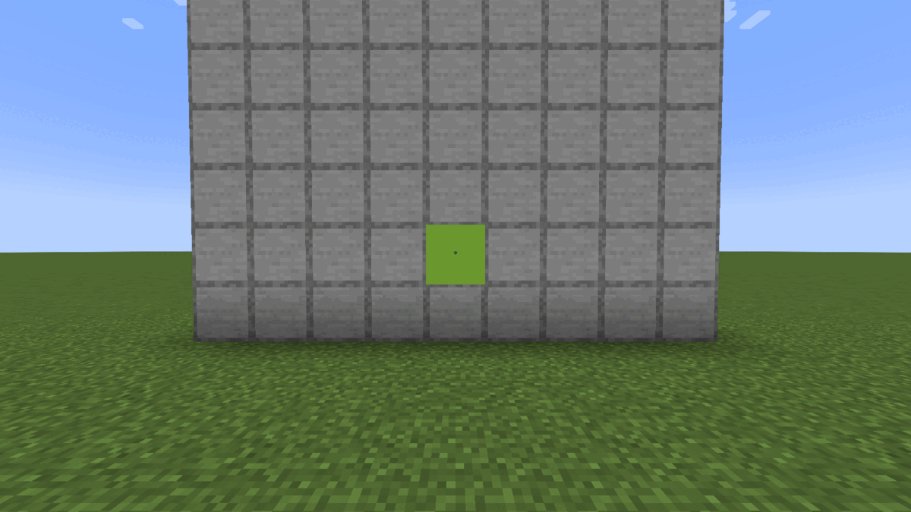

# Placing your art in-game

You've exported from the web editor and copied `loominary_state.json` to `config/` and the `.litematic` file(s) to `schematics/`. This page is the in-game half, in order.

## 1. Load and inspect the state

Launch the game and the mod reads the state JSON automatically. `/loominary status` shows the composition: source, grid, title, codec, and per-tile channel usage (carpet rows, shade bytes, overflow banner count, total bytes). If you have multiple projects, `/loominary save <name>` / `load <name>` switch batches; every import also auto-saves as `<name>_001`, `_002`, … in `loominary_saves/`.

## 2. Place the carpet platform

Load the schematic in Litematica (**M**) and position it flat on the ground. Two things matter a great deal here: **where** (the map grid) and **what's north of it** (the noobline). Get both right before placing a single carpet.

### Align to the map grid

Minecraft maps don't center on where you stand. The world is divided into a **fixed grid of 128×128 map cells, offset by 64 blocks**: cell boundaries fall at X/Z = …, −64, 64, 192, 320, … (multiples of 128, minus 64). A map you create anywhere inside a cell always covers exactly that cell ([minecraft.wiki: Map](https://minecraft.wiki/w/Map)).

Your platform must line up with one cell exactly:

1. Press **F3** and find a corner where both X and Z are ≡ −64 (mod 128), e.g. (64, 64), (−64, 192), (192, −64).
2. Place the schematic's **north-west corner at that cell corner**, rows extending south, columns east.
3. When you scan later, stand anywhere over the platform; the map snaps to the cell, and your carpets land pixel-perfect on it.

A misaligned platform doesn't fail loudly. It shifts every pixel, and the decoder finds garbage. If a scan shows your art cut off at an edge and wrapping oddly, alignment is the first suspect.

The platform is only as deep as your data; a well-compressed image often needs only 15–40 carpet rows, not the full 128.

### Kill the noobline

Map shading is relative to the **north**: a block renders brighter when it sits higher than its northern neighbor and darker when lower. Your carpets sit on top of the ground, so the platform's **top row is higher than the bare ground north of it** and renders as a telltale strip of lighter pixels. This is known as the **noobline**.

To fix it, make the row of blocks **directly north of the platform's first row the same height as the carpet surface**. Either:

- build on a **full map-art platform** (the standard 128×129 designs from schematic sites include the extra northern row for exactly this reason), or
- at minimum, place **one row of 128 blocks** flush against the platform's north edge, topping out level with the carpets.

For **staircase** schematics (shade channel in use) this northern row isn't only cosmetic: the first data row is *read* relative to it, so it must sit at the schematic origin's y-level or the decode itself misreads.

### Placing the carpets

- **By hand** from Litematica's ghost preview.
- **Hands-free**: [`/loominary walk print`](Autonomous-Printing) walks and places everything for you. Note it requires [IceTank's litematica-printer](https://github.com/IceTank/litematica-printer) installed alongside Litematica.
- Inventory helpers either way: `/loominary carpets balance` arranges your carpets to match the schematic's material list; `/loominary carpets fill` restocks from chests catalogued with `/loominary carpets catalogue`.
- Don't let other players' blocks intrude into the footprint before you scan.

## 3. Overflow banners (if the export listed any)

Payload beyond the carpet channel travels as banner names, renamed automatically at any anvil, placed anywhere in the map's area, and registered with `/loominary click`. This has its own page: **[Anvil & Banners](Anvil-and-Banners)**. Small images usually need none.

## 4. Scan, lock, frame

1. Stand at the platform and use an **empty map**; the carpet colors (and staircase shading) snapshot into it. This is the moment the data enters the map.
2. **Lock the map in a cartography table** (map + glass pane). Unlocked maps redraw when terrain changes; locked ones are permanent.
3. Hang it in an item frame.

Within a second the mod decodes it and paints the art, for you and every Loominary user within 32 blocks. Banner marker pins are suppressed client-side. While a heavy animated tile decodes you'll see a progress screen on the map ([status screens](Troubleshooting-and-FAQ#status-screens-on-maps)).

## Previewing before you build

Hang any map in an item frame, look at it, and run `/loominary preview`; the pending art is painted straight onto that framed map, **client-side only**, with no blocks placed, nothing sent to the server, and only you seeing it. On a wall of frames it discovers the whole grid and paints every tile at once. `/loominary revert` (or `revert all`) puts the maps back exactly as they were.

Preview is the fastest way to sanity-check scale, colors, and dithering at actual map size before committing to a build.

## Command crib sheet

| Command | Purpose |
|---|---|
| `/loominary status` / `status donors` | batch overview / mux donor list |
| `/loominary tile next` / `tile <n>` / `tile pos <c> <r>` | switch active tile |
| `/loominary seek <n>` | resume banner work at chunk n |
| `/loominary preview` / `revert [all]` | paint / restore framed maps locally |
| `/loominary click` | auto-register banners ([details](Anvil-and-Banners)) |
| `/loominary carpets balance` / `fill` / `catalogue` | inventory logistics |
| `/loominary export` | regenerate schematics from the loaded state |
| `/loominary stop` | halt every Loominary automation now |

Full list: [Command Reference](Command-Reference).
