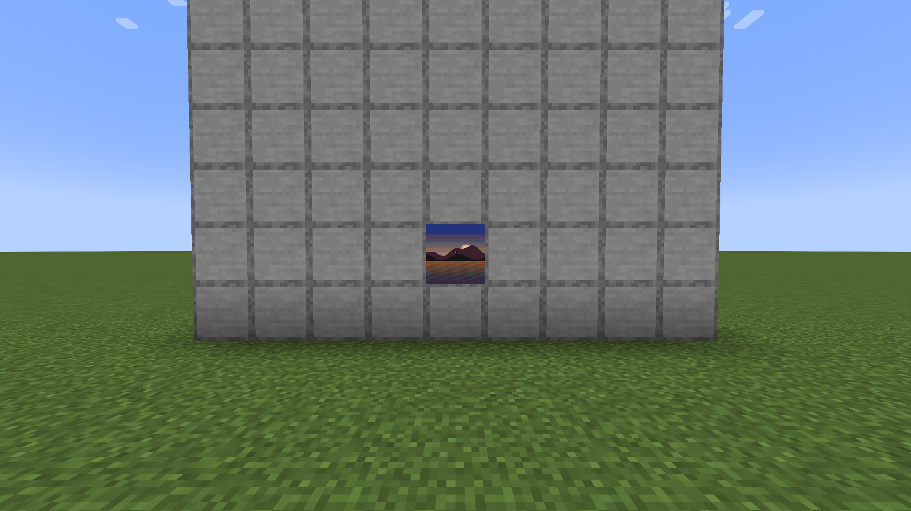

# Placing your art in-game

You've exported from the web editor and copied `loominary_state.json` to `config/` and the `.litematic` file(s) to `schematics/`. This page is the in-game half, in order.

## 1. Load and inspect the state

Launch the game — the mod reads the state JSON automatically. `/loominary status` shows the composition: source, grid, title, codec, and per-tile channel usage (carpet rows, shade bytes, overflow banner count, total bytes). Multiple projects? `/loominary save <name>` / `load <name>` switch batches; every import also auto-saves as `<name>_001`, `_002`, … in `loominary_saves/`.

## 2. Place the carpet platform

Load the schematic in Litematica (**M**) and position it **flat on the ground**, anywhere with a clear 128×128 footprint. What you're building is literally the payload:

The platform is only as deep as your data — a well-compressed image often needs only 15–40 carpet rows, not the full 128. Two placement rules:

- If the export produced a **staircase** schematic (shade channel in use), the terrain one block north of the schematic's north edge must sit at the same y-level as the schematic origin, so the first row reads at the correct height.
- Don't let other players' blocks intrude into the footprint before you scan.

Placing options:

- **By hand** from Litematica's ghost preview.
- **Hands-free**: [`/loominary walk print`](Autonomous-Printing) walks and places everything, restocking itself from chests.
- Inventory helpers either way: `/loominary carpets balance` arranges your carpets to match the schematic's material list; `/loominary carpets fill` restocks from chests catalogued with `/loominary carpets catalogue`.

## 3. Overflow banners (if the export listed any)

Payload beyond the carpet channel travels as banner names — renamed automatically at any anvil, placed anywhere in the map's area, and registered with `/loominary click`. This has its own page: **[Anvil & Banners](Anvil-and-Banners)**. Small images usually need none.

## 4. Scan, lock, frame

1. Stand at the platform and use an **empty map** — the carpet colors (and staircase shading) snapshot into it. This is the moment the data enters the map.
2. **Lock the map in a cartography table** (map + glass pane). Unlocked maps redraw when terrain changes; locked ones are permanent.
3. Hang it in an item frame.

Within a second the mod decodes it and paints the art — for you and every Loominary user within 32 blocks. Banner marker pins are suppressed client-side. While a heavy animated tile decodes you'll see a progress screen on the map ([status screens](Troubleshooting-and-FAQ#status-screens-on-maps)).

## Previewing before you build

`/loominary preview` paints the pending art directly onto framed maps at your crosshair — client-side only, no blocks, no server interaction. On a wall of frames it discovers the whole grid and paints every tile:

`/loominary revert` (or `revert all`) restores the frames. Preview is the fastest way to sanity-check scale and dithering at actual map size before committing to a build.

## Command crib sheet

| Command | Purpose |
|---|---|
| `/loominary status` / `status donors` | batch overview / mux donor list |
| `/loominary tile next` / `tile <n>` / `tile pos <c> <r>` | switch active tile |
| `/loominary seek <n>` | resume banner work at chunk n |
| `/loominary preview` / `revert [all]` | paint / restore framed maps locally |
| `/loominary click` | auto-register banners ([details](Anvil-and-Banners)) |
| `/loominary carpets balance` / `fill` / `catalogue` | inventory logistics |
| `/loominary export` | regenerate schematics from the loaded state |
| `/loominary stop` | halt every Loominary automation now |

Full list: [Command Reference](Command-Reference).
