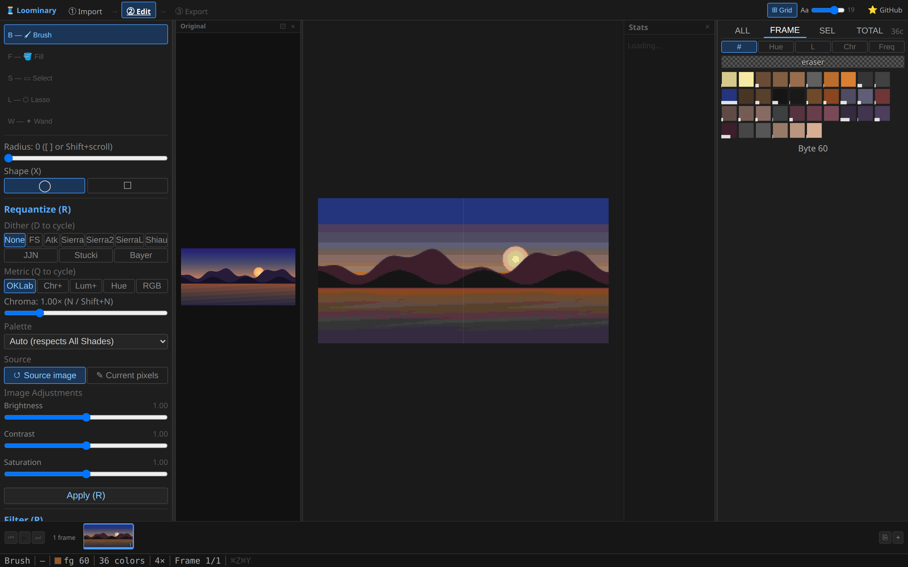
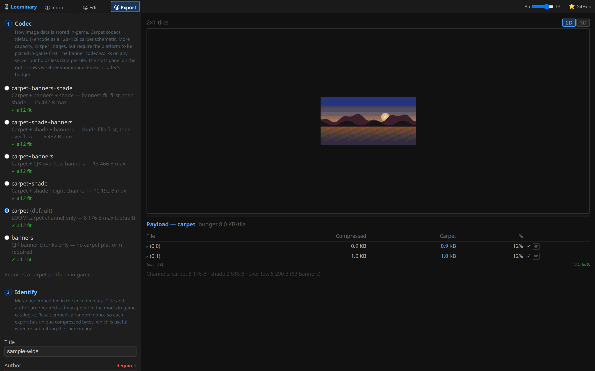
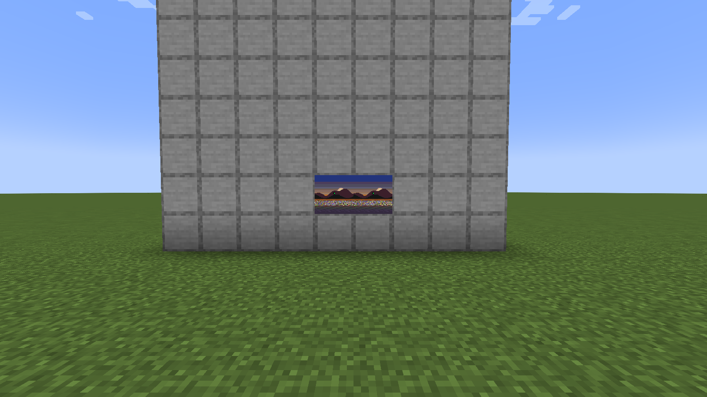

# Multi-tile murals & mux

One map is 128×128 pixels. A mural is a grid of them — and two pieces of machinery keep grids painless: whole-composition processing (no visible seams) and **mux** (no wasted bytes).

## Making a mural

1. Set the grid at [import](Web-Editor-Import) (Cols × Rows, up to 128 each; "auto" derives it from the aspect ratio). Quantization and dithering run on the **whole image before splitting**, so colors and dither patterns flow across tile borders as if they weren't there.
2. Edit with the **⊞ Grid** canvas — selections, fills, and brush strokes work across boundaries:

   

3. Export produces one schematic per tile, named `loominary_carpet_r<row>_c<col>.litematic`, plus per-tile budget stats:

   

In-game: place each tile's platform, scan a map per tile, hang them in a matching wall of item frames ([placement guide](In-Game-Placement)). `/loominary tile next` / `tile pos <col> <row>` step the active tile for banner work. **Preview discovers the whole wall**: look at any one frame and `/loominary preview` paints every tile of the grid:

## Mux: byte-budget socialism

Tiles never fill evenly: the sky tile compresses to 800 bytes while the busy center tile wants 18,000. **Mux** lets over-budget tiles (*receivers*) spill overflow into under-budget siblings (*donors*):

- Each donor reserves part of its channel capacity for **guest segments** — 10 bytes of routing descriptor plus the guest bytes, invisible to the donor's own art.
- The export page's mux panel shows the whole allocation: every tile's **role** (normal / **receiver** / **donor**), its own vs guest byte counts, and who routes to whom. If the art tiles can't absorb everything, **blank auto-donor tiles** (pure carriers, no art) are appended.
- In banner-only mode donors work too — a donor tile spends spare banner slots on guest chunks (one extra routing banner per guest).
- The mod reassembles every receiver from its donors before decoding. The allocator is implemented identically in the web editor and the mod and locked by cross-language tests, so a web-baked allocation always reassembles.

In-game equivalents: `/loominary mux` appends blank donor tiles to the loaded batch (`mux undo` removes them), and `/loominary status donors` pages through donor assignments.

## All-or-nothing decoding

A muxed receiver can't decode until its donors are scanned, and a [composite lossy animation](Animated-Art) needs *every* tile scanned. Until then, waiting tiles paint a status screen counting scanned siblings:

Scan each map of the grid once — the whole wall then resolves together.

## Practical grid advice

- Frames on a wall must form the same grid shape as the export — the decoder identifies tiles by grid position embedded in each payload, but `preview`'s auto-discovery and animation sync work frame-adjacency out from what you're looking at.
- Murals multiply everything: platforms, scans, banners. The `carpet+shade+banners` codec variant trades staircase building for fewer banners if your bottleneck is anvil time.
- For *animated* murals, composite lossy encoding means seams never exist in the first place — see [Animated Art](Animated-Art).
