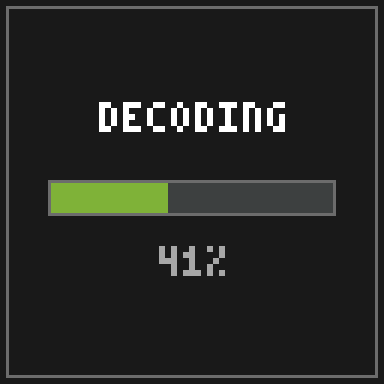
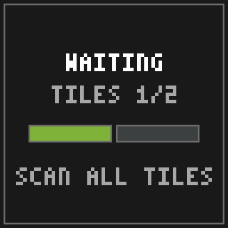
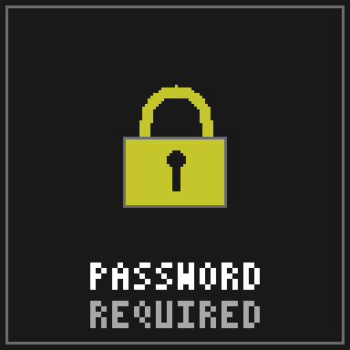
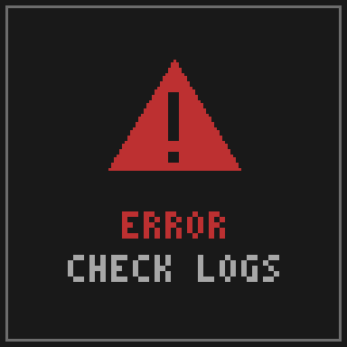

# Troubleshooting & FAQ

## Status screens on maps

When a tile can't display its art yet, the mod paints a status screen instead of leaving the map blank or noisy:

| Screen | Meaning | Fix |
|---|---|---|
|  | AV1 decode in progress (live bar, ~0.1–0.25 s per frame) | Wait a few seconds |
|  | Composite animation or muxed tile awaiting sibling tiles (`TILES n/N`) | Scan every map of the grid once |
|  | Encrypted, no stored password matches | `/loominary password add <pw>` |
|  | Decode failed | Check the game log; usually a partial scan or an outdated mod |

## Common problems

**Other players don't see my image.**
That's expected; Loominary is client-side. Viewers need the mod (and the password, if encrypted). Everyone else sees a normal carpet-colored map.

**The map shows raw carpet colors, not art.**
The decoder didn't engage. Checklist, in order: ① `/loominary status` shows the batch (state JSON in `config/`?). ② The map was scanned *after* the platform was completely placed; rescan with a fresh map if unsure. ③ Overflow banners placed and registered (`/loominary click` finishes with "Map decoded — auto-click complete."). ④ You're within 32 blocks (the decoder rescans every second). ⑤ Decoding is toggled ON. There's a keybind that flips raw/decoded view, which is easy to hit accidentally; it says "Loominary decoding OFF (raw maps)" in chat when off.

**My image looks fuzzy / colors are off.**
Palette limits. Work through the [Dithering & Color Matching](Dithering-and-Color-Matching) tuning recipe (saturation nudge, dither algorithm, chroma boost) and watch the coverage score. Bold shapes beat photographic noise.

**"Import aborted — over budget" in-game.**
The in-game import is the no-frills path and can't shrink images. Take the image to the web editor, which has an answer for every over-budget case: [palette reduction](Editor-Tools#requantize-filters-reduce), gentler dithering, [mux](Multi-Tile-and-Mux), or [lossy AV1](Animated-Art) for animations. Multi-tile in-game imports can also try the `mux` import flag.

**The anvil handler says `Paused — out of XP.`** (or banners/bundles)
Nothing is wrong; restock and it resumes by itself. You need 1 level per banner. Details on [Anvil & Banners](Anvil-and-Banners).

**The anvil handler says `Stuck — re-export from the web editor (fresh salt), then /loominary load`.**
The server permanently rejected a banner name (rare; usually a chat filter). Re-export the art: every export carries a fresh salt, so all names change while the art doesn't. Copy the new state JSON in (or `/loominary load` a saved copy) and discard the old renamed banners. Loading fresh state clears the halt.

**`/loominary click` says `Move closer to banners (N remaining)`.**
Its reach is ~4.5 blocks and it scans ±5 around you, so walk the banner field and it works through them. `Hold your map to continue.` means you switched items mid-run.

**Animated tile plays for me, freezes or errors for a friend.**
Their mod predates the AV1 codec. Art needs the mod version that made it, or newer.

**My [full-color (sRGB)](Full-Color-sRGB) art shows for me, but my friend sees an undecoded tile.**
They're on an older Loominary version; full color needs **v2.1.0 or newer** to decode. Older versions show the undecoded tile (carpet noise or banner markers) rather than garbage, and vanilla players see an ordinary carpet map as always.

**The animation stutters when I walk away and back.**
That's the 32-block distance culling. The tile rejoins its sync group on the correct frame, and a brief catch-up is normal.

**A command told me it was removed in v2.0.0.**
All image editing moved to the web editor. The [command reference](Command-Reference#removed-in-v200--where-it-went) maps each removed command to its replacement.

## FAQ

**Is this allowed on servers?**
The pipeline uses only vanilla mechanics (renaming banners, right-clicking them with maps, placing blocks) and rendering is client-side. The *automation* features (auto-click, walk-print, auto-fill) may fall under a server's automation rules, so check those.

**Singleplayer? Realms?**
Yes to both, since the mod is fully client-side.

**What's "legal palette" vs "all shades"?**
Maps encode 4 brightness shades per base color; only 3 occur from real block placement. "All shades" adds the fourth (244 colors total) for fidelity, at the cost that the art can't exist as a physical build. [Details](Dithering-and-Color-Matching#palette-restriction).

**Does [full color mode](Full-Color-sRGB) work with ImmediatelyFast / MapMipMapMod?**
Yes, automatically. ImmediatelyFast's map atlas replaces the vanilla map texture, so Loominary hooks IF's atlas fill (the hook ships in the jar and only activates when IF is installed) and writes the true colors there. MapMipMapMod, which requires IF, then generates its mipmaps from those colors, so full-color art looks right at a distance too. No configuration needed for either.

**Why ~15 KB per tile?**
That's the sum of the vanilla channels: 8,176 B carpet + 2,016 B shade + 5,290 B banners. Compression makes it feel much bigger, and typical images use 1.5–6 KB. The full math is on [Codecs & Capacity](Codecs-and-Capacity).

**Where does everything live on disk?**

| Path (relative to game dir) | Purpose |
|---|---|
| `config/loominary_state.json` | the active batch |
| `loominary_data/` | source images for in-game import |
| `loominary_saves/` | named + auto batch saves |
| `loominary_exports/` | schematics and image exports |
| `loominary_chest_memory.json` | the carpet chest catalogue |

**How do I uninstall?**
Delete the jar. Art already in the world stays visible to other Loominary users; you'll see plain maps.
