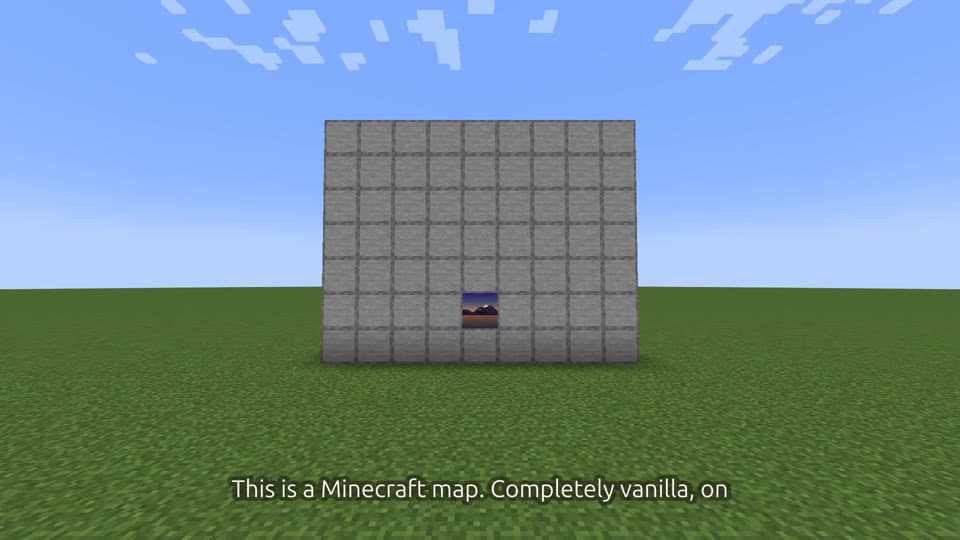
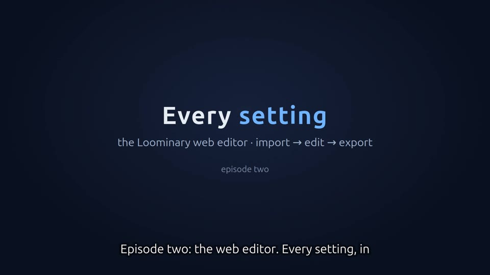
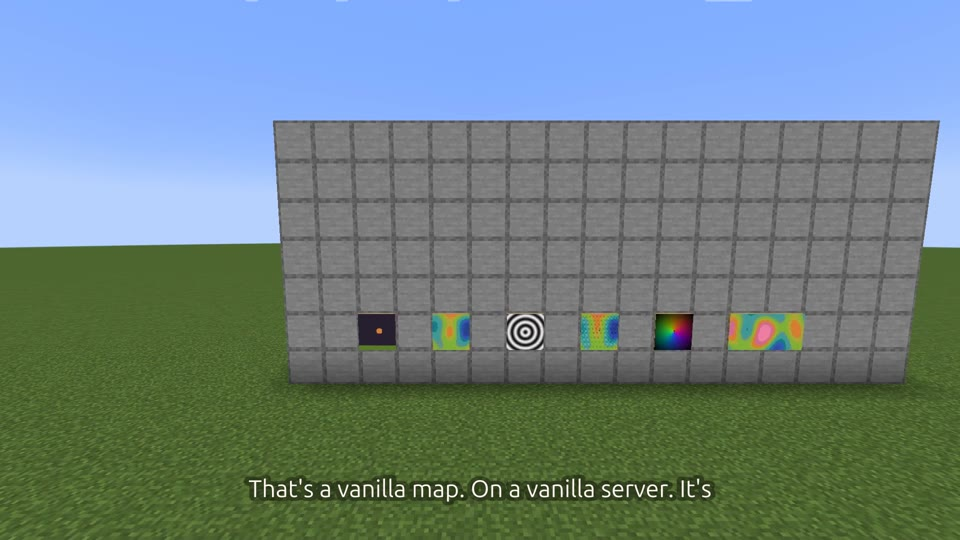
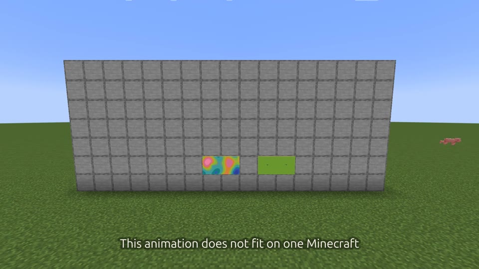
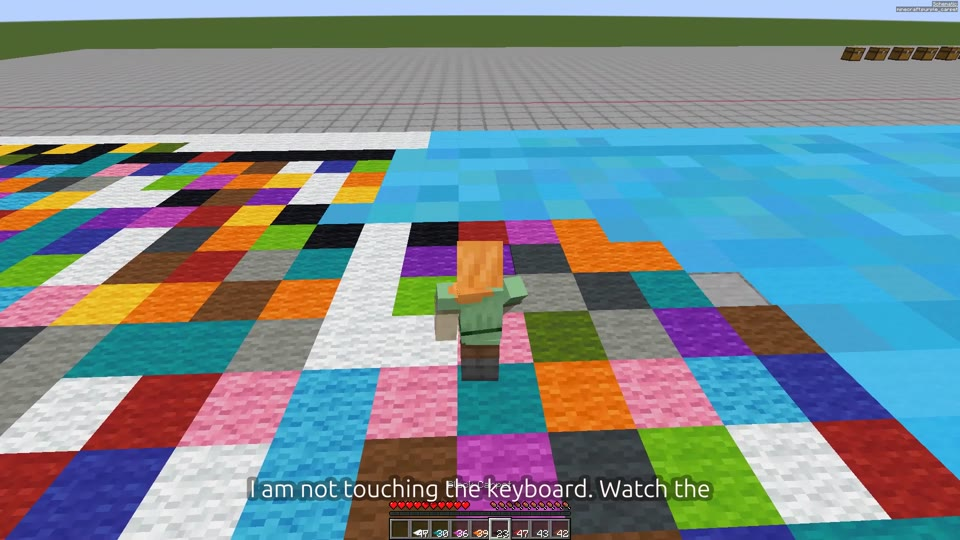
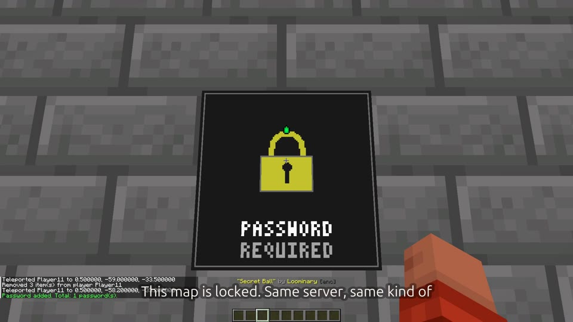
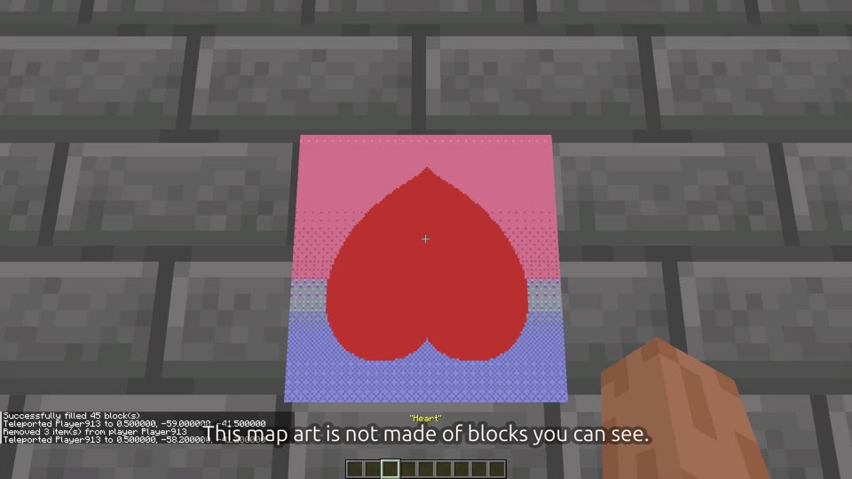
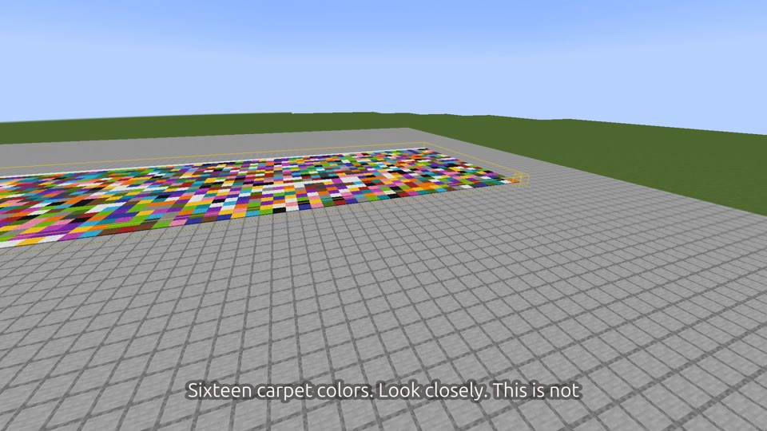

<!--
  MAINTAINER NOTE (this HTML comment is invisible on the rendered wiki):

  Each episode below has a <video> element whose src is a placeholder token
  (VIDEO_URL_EPnn). GitHub only plays a video INLINE when the file is served
  from its own CDN (github.com/user-attachments/assets/...). Those URLs are
  minted by uploading the mp4 once through the GitHub web UI — they are NOT
  committed to git. Until the tokens are replaced with real user-attachments
  URLs, GitHub strips the <video> (non-GitHub src) and readers fall back to the
  poster thumbnail, which links to the same token.

  To fill them in, follow docs/videos/WIKI-VIDEO-EMBED.md. In short:
    1. Run docs/videos/tools/encode-for-web.sh  -> docs/videos/out/web/epNN-web.mp4
    2. Open this page's editor at github.com/<owner>/<repo>/wiki/Video-Series/_edit
       (or a throwaway issue), drag each epNN-web.mp4 into the box, wait for upload.
    3. Copy the generated https://github.com/user-attachments/assets/<hash> URL and
       replace every VIDEO_URL_EPnn token for that episode (there are two per block).
    4. Save. Do the same in docs/wiki/Video-Series.md so the source of truth matches.
-->

# Video series

Eight short screencasts covering Loominary end to end, from your first map to how the encoding actually works. Each one plays inline below (click a poster if your viewer doesn't show the player).

> These players are hosted on GitHub's own attachment CDN, not committed to the repo. If you are reading this outside github.com and a player is blank, click the poster image to open the video.

---

### Ep. 01 — Your First Minecraft Map Art in 10 Minutes

The end-to-end hook: an image file becomes framed map art on a vanilla server.

<video src="VIDEO_URL_EP01" poster="assets/video/ep01.jpg" width="640" controls>
  
</video>

[▶ Watch Ep. 01 (3:36)](VIDEO_URL_EP01)

---

### Ep. 02 — The Web Editor Deep-Dive

A full tour of the browser editor: tools, palette control, and dithering.

<video src="VIDEO_URL_EP02" poster="assets/video/ep02.jpg" width="640" controls>
  
</video>

[▶ Watch Ep. 02 (6:15)](VIDEO_URL_EP02)

---

### Ep. 03 — Animated Map Art

Turning an animated GIF into an AV1 stream that plays back on a framed map.

<video src="VIDEO_URL_EP03" poster="assets/video/ep03.jpg" width="640" controls>
  
</video>

[▶ Watch Ep. 03 (4:44)](VIDEO_URL_EP03)

---

### Ep. 04 — Mux & Multi-Tile Art

Spreading one big (and animated) image across an N×M wall of maps, with automatic byte-budget balancing.

<video src="VIDEO_URL_EP04" poster="assets/video/ep04.jpg" width="640" controls>
  
</video>

[▶ Watch Ep. 04 (4:18)](VIDEO_URL_EP04)

---

### Ep. 05 — Fully Autonomous Printing

`/loominary walk print` walks your player along the platform and places every carpet hands-free.

<video src="VIDEO_URL_EP05" poster="assets/video/ep05.jpg" width="640" controls>
  
</video>

[▶ Watch Ep. 05 (3:47)](VIDEO_URL_EP05)

---

### Ep. 06 — Encrypted Map Art & Sharing

Locking art with a password (AES-256-GCM) and handing the files to another player.

<video src="VIDEO_URL_EP06" poster="assets/video/ep06.jpg" width="640" controls>
  
</video>

[▶ Watch Ep. 06 (2:10)](VIDEO_URL_EP06)

---

### Ep. 07 — The Banner Channel

The legacy banner-only channel: whole images encoded into nothing but banner names.

<video src="VIDEO_URL_EP07" poster="assets/video/ep07.jpg" width="640" controls>
  
</video>

[▶ Watch Ep. 07 (3:00)](VIDEO_URL_EP07)

---

### Ep. 08 — Tips, Troubleshooting & How It Actually Works

A look under the hood: the shade/nibble packing and the full encode pipeline.

<video src="VIDEO_URL_EP08" poster="assets/video/ep08.jpg" width="640" controls>
  
</video>

[▶ Watch Ep. 08 (2:48)](VIDEO_URL_EP08)
