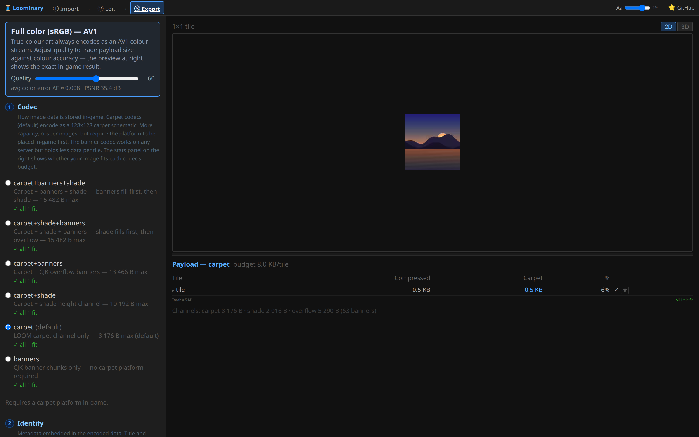
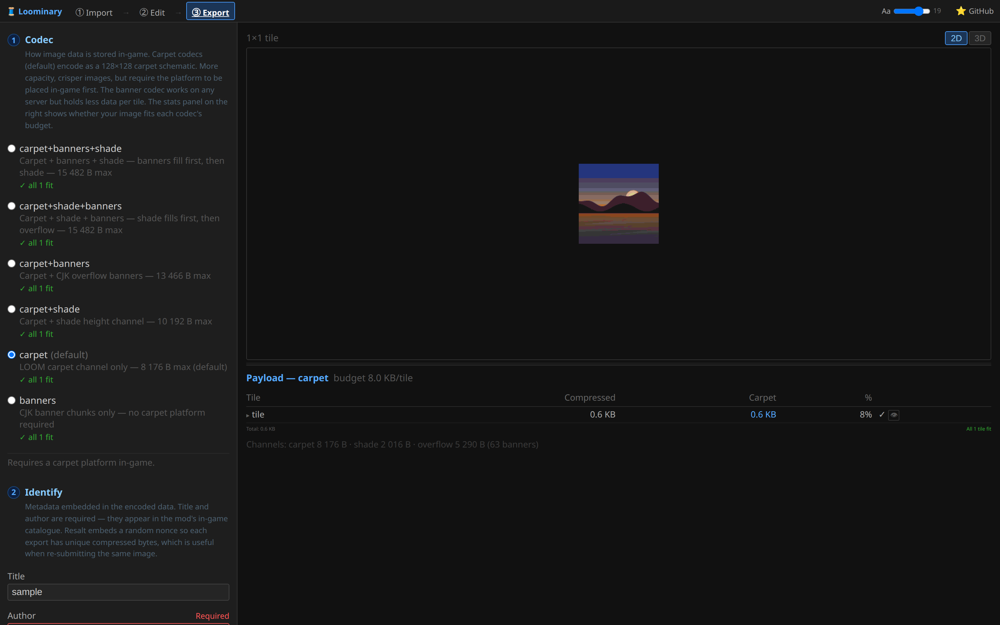

# Web editor · Step 3: Export

Export encodes your composition into the exact bytes the mod will decode, shows the accounting per tile, and packages everything for the game. There are four numbered steps: **Codec · Identify · Encrypt · Export**.

## ① Codec

Which vanilla data channels carry the payload, and therefore each tile's byte budget:

| Label | Budget/tile | Notes |
|---|---|---|
| `carpet+banners+shade` | 15,482 B | banners fill before shade; the maximum-capacity pick |
| `carpet+shade+banners` | 15,482 B | shade fills before banners (fewer banners, staircase sooner) |
| `carpet+banners` | 13,466 B | never a staircase |
| `carpet+shade` | 10,192 B | zero banners |
| `carpet` (default) | 8,176 B | pure platform, no banners or staircase; most images fit here after compression |
| `banners` | 5,290 B | no platform at all ([legacy mode](Banner-Mode-Legacy)) |

Each radio shows a live fit line ("✓ all N fit" / "⚠ M/N tiles over budget"), and the stats table breaks every tile into carpet / shade / banner bytes with a percentage bar. Full channel mechanics: [Codecs & Capacity](Codecs-and-Capacity).

## Lossy AV1 (animations only)

Animated compositions get a prominent **"⚡ Lossy animation — much smaller"** toggle with a **quality slider (1–100, default 60)**. Lossless AV1 is always tried first and is usually enough; lossy is for dithered or noisy animations that refuse to compress. The panel reports the measured "% of pixels differing from the original", and since the preview runs the same decoder the mod ships, what you see is what players get. Heavy compositions (60+ frames) compute sizes on demand: the **Recompute** button appears whenever a setting has made the stats stale, and nothing recomputes on its own.

## Full color (sRGB) compositions

Compositions imported in [Full color (sRGB)](Full-Color-sRGB) mode replace the lossy checkbox with an always-on **"Full color (sRGB) — AV1"** panel; the mode has no lossless variant, so the same **quality slider (1–100)** applies to static art as well as animations. The fidelity readout is **"avg color error ΔE ≈ x.xxx · PSNR y.y dB"** (mean OKLab ΔE between original and decoded result, plus RGB peak signal-to-noise ratio) instead of the palette mode's pixel-difference percentage, and the static preview shows the decoded result.

## ② Identify

- **Title** (≤64 chars) and **Author** (≤16) are embedded in the payload and shown to whoever decodes it. Both required; the author persists in your browser.
- **Resalt (nonce)** randomizes the compressed bytes without changing the image. Every export gets a random nonce regardless; this checkbox forces fresh bytes on demand (the fix for [stuck anvil renames](Anvil-and-Banners#the-anvil-auto-renamer)).

## ③ Encrypt

Optional AES-256-GCM payload encryption with one key slot per password, and any single password decodes. It costs about 290 B + 76 B per password, per tile (the stats table accounts for it automatically, and encrypted tiles show a 🔒). Full guide: [Encryption & Sharing](Encryption-and-Sharing).

## Mux (multi-tile)

When some tiles bust their budget and siblings have room, the mux allocator routes the overflow. The panel lists every tile's **role** (normal / receiver / donor), its own vs guest bytes, and the donor↔receiver routing. Blank auto-donor tiles are added if the art tiles alone can't absorb everything. Full guide: [Multi-Tile & Mux](Multi-Tile-and-Mux).

## The 3D schematic viewer

Every carpet-codec tile gets a **physical preview** of its schematic: the actual carpet blocks, flat or staircase (drag = orbit, shift+drag = pan, scroll = zoom, plus a 2D mode). This shows what you're actually building:

## ④ Export

**⬇ Export ZIP** (suffixed "(encrypted)" / "(mux)" when active) produces:

| File | Destination |
|---|---|
| `loominary_state.json` | `<game dir>/config/` (the payload itself) |
| `loominary_carpet_r<row>_c<col>.litematic` | your `schematics/` folder, one per tile (carpet codecs only) |
| `preview.png` / `preview.mp4` | the exact decoded result (MP4 for animations) |
| `README.txt` | offline install instructions |

If any tile is still over budget, the export interrupts with an explicit warning (the art won't decode in-game until it fits) and offers the fixes (mux, higher-capacity codec, fewer colors/frames) before letting you "Export anyway".

Then head in-game: **[Placing your art](In-Game-Placement)**.
