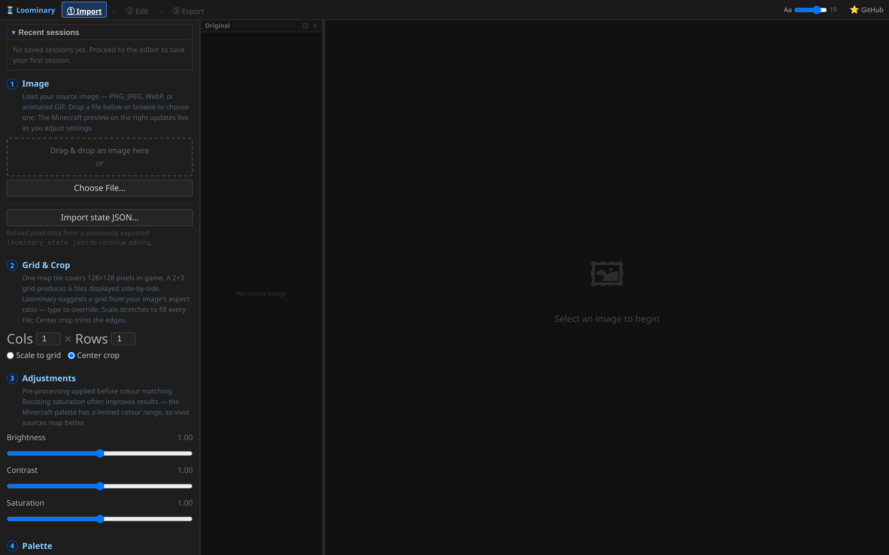
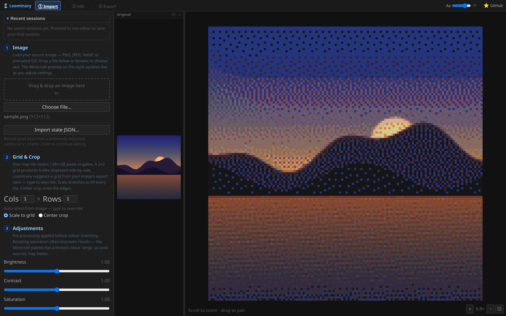

# Web editor · Step 1: Import

The import page turns your source image into map-palette pixels. Everything runs locally in your browser; nothing is uploaded anywhere. The page is a numbered wizard down the left side, and the right side is a live preview of the final result.

## ① Image

Drop a file or **Choose File…**: PNG, JPEG, WebP, BMP, or animated GIF (all frames come along; see [Animated Art](Animated-Art)). Two other entry points live here too:

- **Import state JSON…** loads a previously exported `loominary_state.json` so you can resume editing without the source image (works for every codec, including muxed exports). This is also how you [edit captured art](Stealing-Map-Art).
- **Session history**: the editor auto-saves complete sessions (source image included) to your browser; load or delete them here.

## ② Grid & Crop

One map tile is 128×128 pixels; a composition is a **Cols × Rows** grid of them (each 1–128). Loominary suggests a grid from your image's aspect ratio; type to override, or hit **auto** to re-derive. Then choose how the image meets the grid:

- **Scale to grid** stretches or squeezes the image to fill every tile exactly.
- **Center crop** (default) preserves aspect ratio and trims the overflow edges.

Multi-tile guidance: [Multi-Tile & Mux](Multi-Tile-and-Mux).

## ③ Adjustments

Brightness, contrast, and saturation (each 0–2, default 1.0), applied at full resolution *before* color matching. The map palette is muted, so a small saturation push (1.1–1.3) is the most common improvement. Transparent pixels pass through untouched.

## ④ Palette

Which palette entries quantization may use, from all 244 shades down to 16 flat carpet colors, plus a greyscale mode with an adjustable chroma threshold. Full table and guidance: [Dithering & Color Matching](Dithering-and-Color-Matching#palette-restriction).

## ⑤ Quantization

Where most of the quality comes from: **ten dither algorithms** (Floyd–Steinberg through Jarvis–Judice–Ninke to ordered Bayer, each with a strength slider and serpentine option), **five match metrics** (perceptual OKLab default), and a **chroma boost** slider. This gets its own page, [Dithering & Color Matching](Dithering-and-Color-Matching), with side-by-side comparisons.

## The preview pane

- **Scroll to zoom · drag to pan.** The default 4× zoom shows dither texture honestly.
- The small **Original** thumbnail keeps the source in view for comparison.
- **Palette coverage: N%** scores how well the current palette suits this image: the percentage of pixels whose best palette match lands within a perceptual ΔE of 0.05, colored green ≥75% / amber ≥50% / red below, with the average ΔE alongside. Dithering and chroma boost deliberately don't move this number, so it's a clean instrument for comparing palettes and adjustments.

## ⑥ Proceed

**Proceed to Editor →** encodes and hands off. Animated GIFs quantize every frame in a worker pool at this point (one worker per CPU core) with a "Quantizing frame X of Y…" progress bar; the import preview itself only shows frame 1.

→ **[Step 2: Edit](Web-Editor-Editing)**
